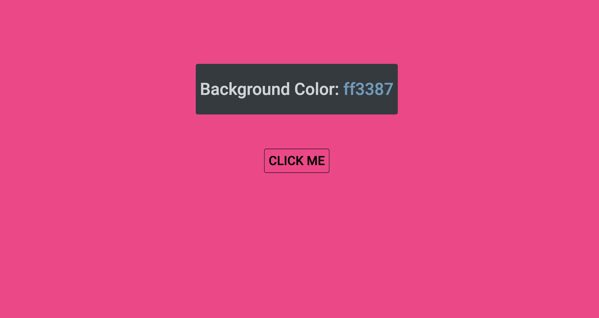

# ColorFlipper

This code changes the background color of the webpage to a random color from a predefined list when a user clicks on an element (likely a button or header). The color is selected from an array of hex color codes. Additionally, the hex code of the selected color is displayed within a  element on the page.

